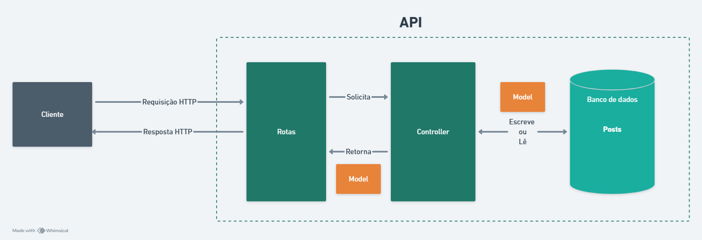

# Blog Educacional

Esta API se propõe a implementar o back-end de um site em formato de *Blogging* voltado para que professores disponibilizem conteúdos escritos para os seus alunos. 

Portanto a API visa fornecer as rotas necessárias para a manipulação dos conteúdos que estão contidos dentro de **posts**.

Esta aplicação foi desenvolvida visando cumprir os requisitos estabelecidos pelo Tech-Challenge da Pós-Tech em Desenvolvimento Full-Stack da FIAP.


## Estrutura da aplicação e tecnologias utilizadas

A API seguiu o padrão *Model View Controller* ou *MVC*, que organiza a aplicação em três componentes principais: Model, que lida com a lógica de dados e interação com o banco de dados; View, que em nossa API REST, serão as respostas JSON; e Controller, que processa as requisições HTTP, coordena a lógica entre o Model e a View, e retorna a resposta ao cliente. 



A aplicação foi implementada em javascript utilizando o Node.Js. Visando facilitar e agilizar o desenvolvimento, foram utilizadas algumas bibliotecas disponíveis no npm, são elas: Express, mongoose e jest.

O **express** desenvolve um papel fundamental, já que é a framework que fornece diversas ferramentas prontas para a implementação de um servidor HTTP, de rotas para a API e recursos para lidar com as requisições e respostas para o servidor.

O **mongoose** serviu para que a interação com o banco de dados mongo DB fosse facilitada. Através dos *schemas* podemos padronizar os dados enviados e também utilizar os recursos do mongoose para realizar buscas ao banco de dados de maneira mais legível no código.

Já o **jest** foi utilizado para auxiliar na construção dos testes implementados nas rotas e nas controllers da aplicação.


## Setup Inicial


### Pré-requisitos

- [Node.js](https://nodejs.org/) v14.x ou superior
- [Docker](https://www.docker.com/get-started)

### Instalação

#### 1. Clone o repositório:

    git clone https://github.com/BernardoS/tc-posts-api.git
    cd Blog

#### 2. Instale as dependências (Caso deseje executar o projeto localmente, sem o uso do container):

    npm install

### Executando o Projeto

#### Usando Docker

#### 1. Construa e inicie os serviços usando Docker Compose:
    
    docker-compose up --build
    
#### 2. Acesse a aplicação em `http://localhost:3000`.


## Guia de Uso

Para facilitar a documentação da API foi gerada uma documentação das rotas utilizando o Swagger. Para acessar a documentação, inicie o servidor e acesse http://localhost:3000/api-docs.


Estrutura dos Endpoints

#### 1. Rotas Públicas
```sh
GET /posts: Retorna todos os posts
GET /posts/{id}: Retorna um post pelo ID
GET /admin/posts/search: Busca posts por título
```

#### 2. Rotas de Administração
```sh
GET /admin/posts: Retorna todos os posts para o admin
POST /admin/posts: Cria um novo post
PUT /admin/posts/{id}: Atualiza um post existente
DELETE /admin/posts/{id}: Deleta um post
```

## Desafios Encontrados

### Integração de Tecnologias

A migração da plataforma OutSystems para Node.js foi um dos maiores desafios. Isso exigiu a recriação do backend e a introdução de uma nova camada de persistência de dados com MongoDB. Apesar de a transição ter sido relativamente tranquila, foi necessário um esforço considerável para a adaptação às novas ferramentas e fluxos de trabalho.

### Trabalho em equipe

A coordenação entre os membros do time foi outro ponto crítico. Definir responsabilidades claras e gerenciar o tempo de forma eficiente foram desafios significativos. A prática de versionamento via Git foi fundamental para organizar o código, enquanto o uso do Trello permitiu uma divisão clara das atividades e o acompanhamento do progresso de cada tarefa. Isso garantiu que todos tivessem visibilidade do estado do projeto e facilitou a colaboração entre os membros afim de alcançar o objetivo final do projeto. 